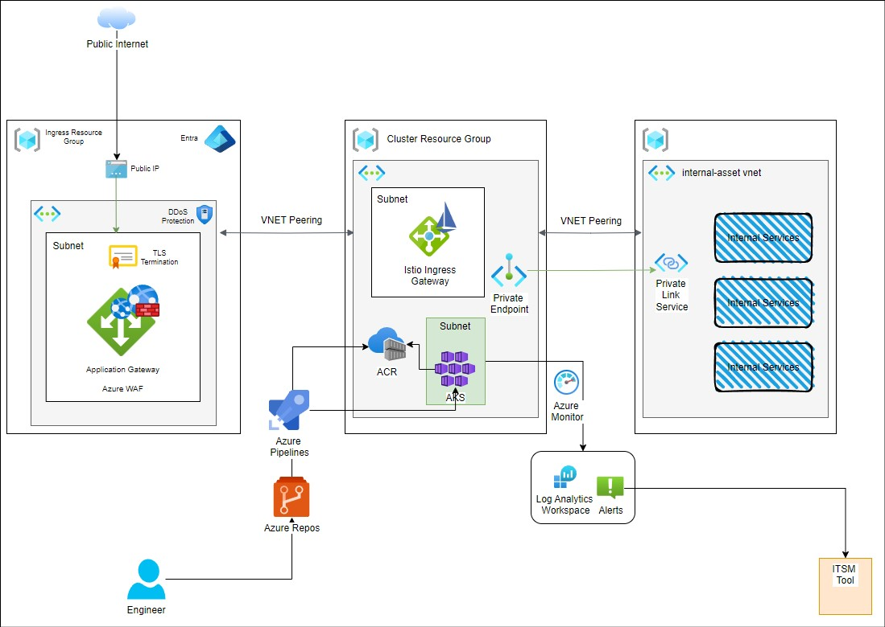

# super-service
## Part-1
Pre-requisites:

1) Ensure Docker Desktop or Docker Engine is installed on your machine.
2) Install the .NET Framework 3.1.0 on your machine.

Deployment instructions:

1) Clone the source code: `git clone https://github.com/arjunvalayanal95/super-service.git`
2) Execute `Deploy.ps1`

- The script will first execute unit tests. If any test fails, an error will be displayed, and the process will halt. If the tests pass, the build process will proceed.
- In case the Docker build fails, the script will terminate. Otherwise, it will continue to the next phase.
- The Docker image will then be scanned for vulnerabilities using `Docker Scout`, with any detected issues reported as warnings.
- The containerized application will be deployed locally as the final step.

## Part-2

## Design overview

Hosting Provider: `Microsoft Azure`

Applications hosted in the Kubernetes cluster are securely exposed to the internet via 'Azure Application Gateway' with 'Web Application Firewall (WAF)' for added protection.

Users access the applications through the Public IP of the `Application Gateway`, while the Virtual Network (VNET) is safeguarded with `DDoS protection`.

The infrastructure consists of three VNETs:

The `ingress-vnet` is peered with the `cluster-vnet`.
The `cluster-vnet` is peered with the `internal-asset-vnet`

`Istio` is deployed as the Ingress Controller within the AKS cluster to manage incoming HTTP/HTTPS traffic and direct it to the relevant services.

Azure Private Link service and Private Endpoints are used to access resources within the "internal-assets" network, ensuring that traffic between the AKS cluster and internal systems remains private and does not traverse the public internet.

For observability, `Azure Monitor` and `Log Analytics Workspace` are configured. An ITSM tool is integrated with Azure Alerts to automatically create service tickets based on triggered alerts.

Developers can deploy code in a fully automated process using `Azure DevOps`. Code is committed to `Azure Repos`, after which pipelines build the images, push them to `Azure Container Registry`, and deploy them to `AKS`.

## Architectural Diagram

